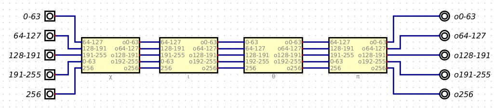

# subterranean2digital

An implementation of [subterranean 2](https://cs.ru.nl/~joan/subterranean.html) in vhdl created with digital. 

Download digital here: [https://github.com/hneemann/Digital/releases](https://github.com/hneemann/Digital/releases)

